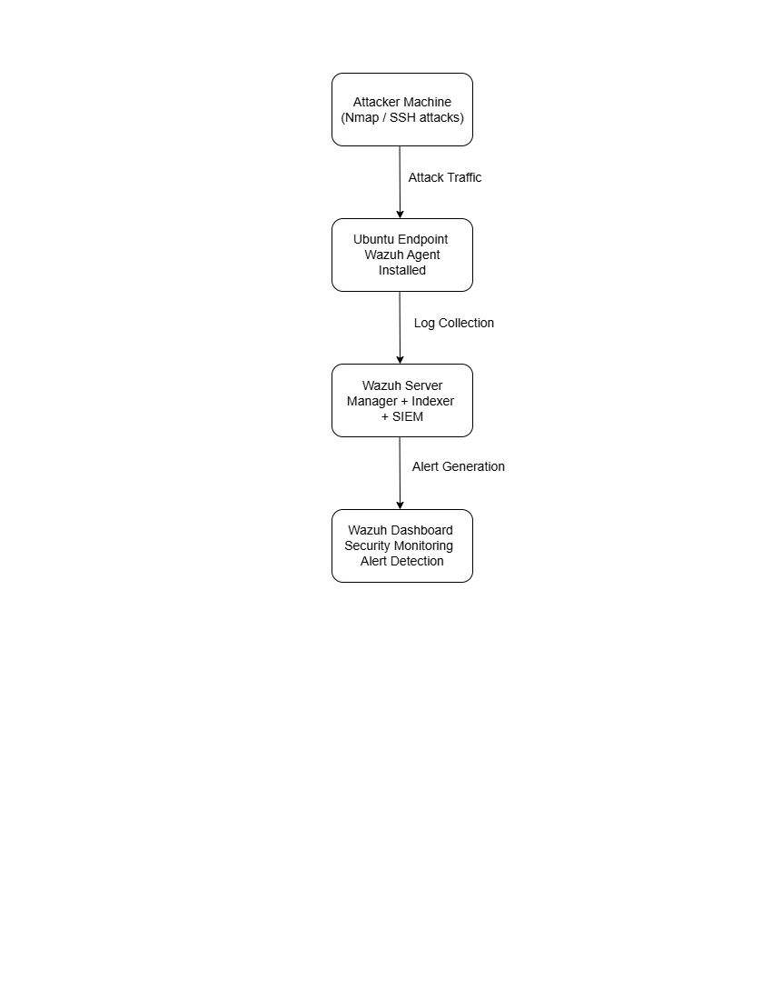
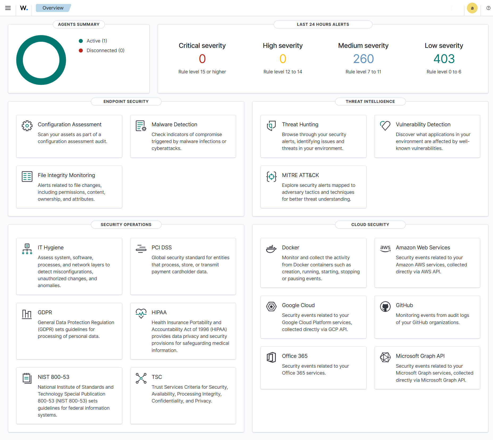
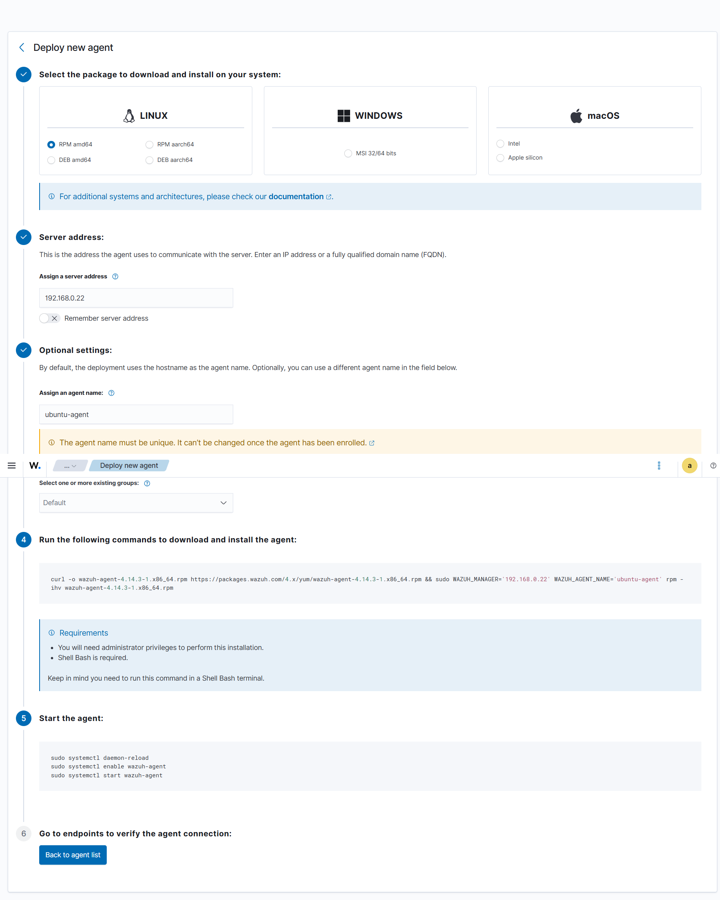
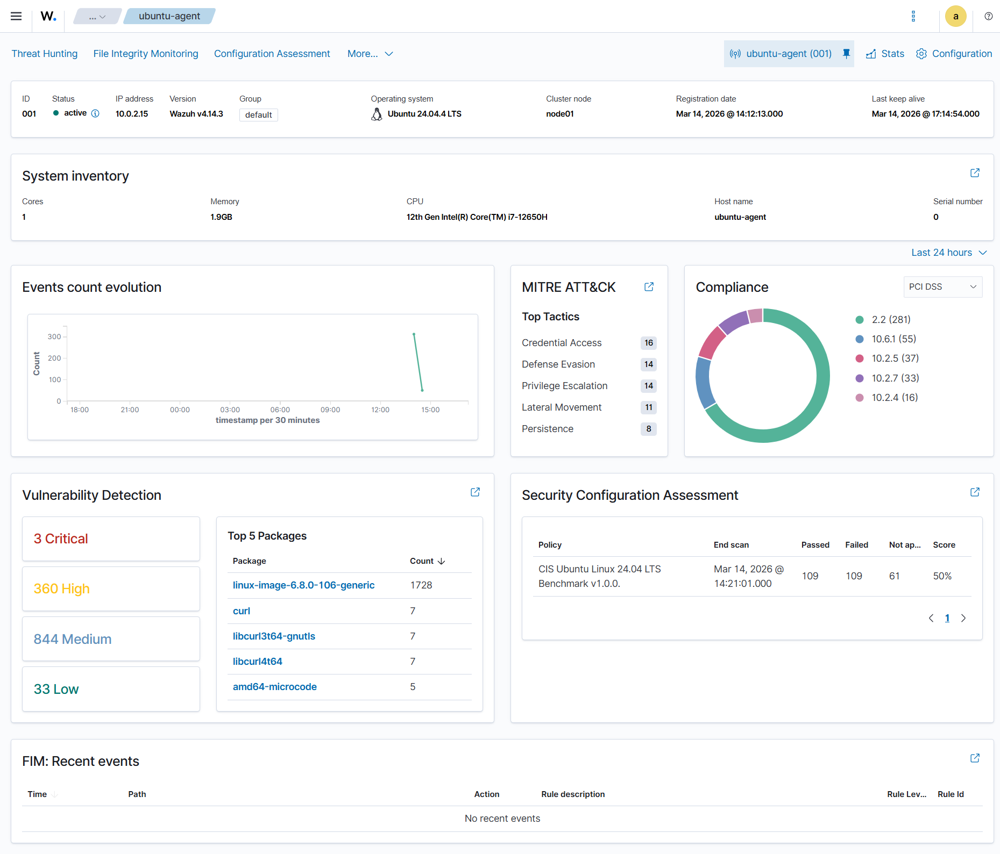
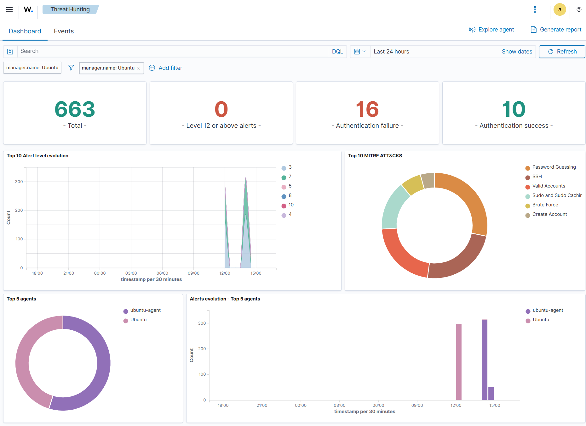
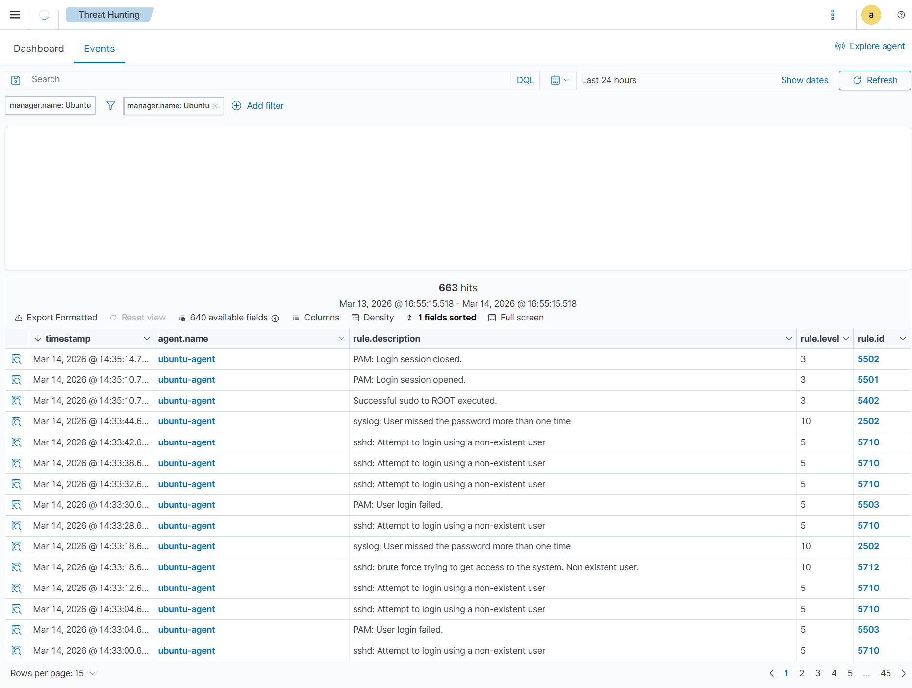
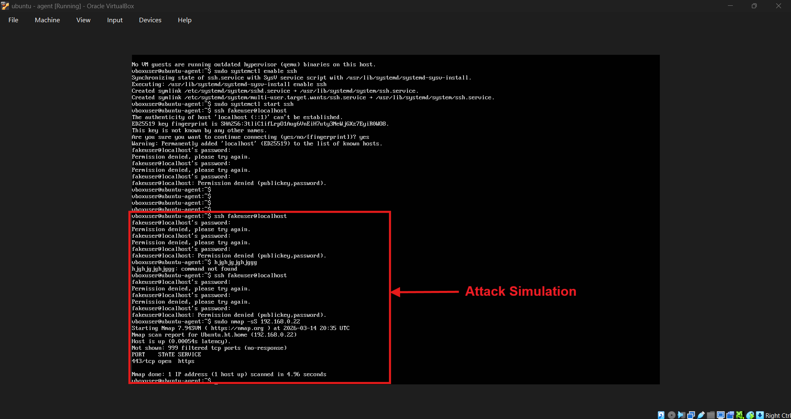

# SOC Security Monitoring Lab (Wazuh SIEM)

A hands-on **Security Operations Center (SOC) lab** built using **Wazuh SIEM** to monitor endpoints, detect suspicious activity, and analyze security alerts.

This project demonstrates how security analysts monitor systems, detect attacks, and investigate events using a centralized SIEM platform.

---

# Project Overview

In this lab environment:

* A **Wazuh SIEM server** collects logs from monitored systems
* An **Ubuntu endpoint** runs the Wazuh agent
* Security events are generated through **attack simulations**
* Alerts are analyzed in the **Wazuh dashboard**

The lab replicates a simplified **SOC monitoring environment used in real-world security operations**.

---

# Architecture

```
Attacker Simulation
      │
      ▼
Ubuntu Endpoint (Wazuh Agent)
      │
      ▼
Wazuh Manager (SIEM Server)
      │
      ▼
Wazuh Dashboard
(Security Monitoring & Threat Detection)
```

## Architecture Diagram



---

# Tools & Technologies

| Tool          | Purpose                           |
| ------------- | --------------------------------- |
| Wazuh         | SIEM and security monitoring      |
| Ubuntu Server | Wazuh manager                     |
| Ubuntu VM     | Monitored endpoint                |
| VirtualBox    | Virtual lab environment           |
| SSH           | Attack simulation                 |
| Nmap          | Network reconnaissance simulation |

---

# Features Demonstrated

* SIEM deployment
* Endpoint monitoring
* Log collection
* Security event detection
* Attack simulation
* Threat hunting
* Vulnerability detection
* MITRE ATT&CK mapping

---

# Attack Simulation

To generate security alerts, the following attacks were simulated.

## SSH Brute Force Attempts

```
ssh fakeuser@localhost
```

Multiple login attempts trigger authentication alerts.

---

## Network Reconnaissance (Nmap Scan)

```
sudo nmap -sS 192.168.0.22
```

This simulates attacker reconnaissance activity.

---

# Security Alerts Detected

Wazuh successfully detected several security events including:

* SSH login attempts using non-existent users
* Brute force authentication attempts
* Failed login events
* Privilege escalation activity
* System log anomalies

These alerts appear in the **Threat Hunting → Events** dashboard.

---

# Screenshots

## Wazuh Dashboard

Shows overall SIEM monitoring and security modules.



---

## Agent Deployment

Deploying an endpoint agent from the Wazuh dashboard.



---

## Agent Connected

Endpoint successfully connected to the SIEM server.



---

## Threat Hunting Dashboard

Security analytics including alert trends and MITRE ATT&CK mapping.



---

## Security Alerts

Detected attack events in the Wazuh Threat Hunting dashboard.



---

## Attack Simulation

SSH brute force attempts and network scanning used to generate alerts.



---

# Detection Rules Triggered

During the attack simulation, the Wazuh SIEM detected multiple security events based on predefined detection rules.

| Rule ID | Description                                 | Severity |
| ------- | ------------------------------------------- | -------- |
| 5710    | SSH login attempt using a non-existent user | Medium   |
| 5712    | SSH brute force attack detected             | High     |
| 5503    | PAM authentication failure                  | Medium   |
| 2502    | Multiple failed login attempts detected     | High     |
| 5402    | Successful sudo privilege escalation        | Low      |

Example events detected:

* `sshd: Attempt to login using a non-existent user`
* `sshd: brute force trying to get access to the system`
* `PAM: User login failed`
* `syslog: User missed the password more than one time`

These alerts were generated when multiple SSH login attempts were simulated on the Ubuntu endpoint.

---

# SOC Analyst Investigation

When the alerts were generated, the activity was investigated using the **Wazuh Threat Hunting dashboard**.

## 1. Identify Suspicious Activity

Security alerts showed multiple SSH login attempts using a **non-existent user account**, which is a common indicator of brute force attacks.

---

## 2. Review Authentication Logs

Authentication events were analyzed from logs collected by the Wazuh agent.

Observed events included:

* Failed SSH login attempts
* Repeated authentication failures
* Non-existent user login attempts

---

## 3. Analyze Event Patterns

The alerts showed a **pattern of repeated login attempts**, confirming a brute force authentication attack.

---

## 4. Map Activity to MITRE ATT&CK Framework

| Technique | Description     |
| --------- | --------------- |
| T1110     | Brute Force     |
| T1078     | Valid Accounts  |
| T1021     | Remote Services |

Mapping alerts to MITRE ATT&CK techniques helps analysts understand attacker behavior.

---

## 5. Confirm Security Detection

The attack simulation successfully triggered alerts in the SIEM dashboard, demonstrating how a SOC analyst can detect and investigate authentication-based attacks.

---

# SOC Monitoring Workflow

```
Attack Simulation
       ↓
Endpoint Logs Generated
       ↓
Wazuh Agent Collects Logs
       ↓
Wazuh Manager Processes Events
       ↓
SIEM Dashboard Displays Alerts
       ↓
SOC Analyst Investigation
```

---

# Lab Setup Guide

Full installation steps can be found here:

[View Setup Guide](setup-guide/installation-steps.md)

The guide includes:

* Installing Wazuh
* Deploying agents
* Configuring monitoring
* Simulating attacks

---

# Learning Outcomes

Through this lab, I gained experience with:

* Security Information and Event Management (SIEM)
* Security monitoring and alert analysis
* Threat detection
* Log analysis
* SOC workflows
* Security incident investigation

---

# Future Improvements

Potential improvements for this project include:

* Adding Windows endpoints
* Integrating Suricata IDS
* Creating custom Wazuh detection rules
* Automating attack simulations
* Expanding threat detection scenarios

---

# Repository Structure

```
soc-security-monitoring-lab
│
├── README.md
│
├── architecture
│   └── soc-architecture.png
│
├── screenshots
│   ├── wazuh-dashboard.png
│   ├── deploy-agent.png
│   ├── agent-connected.png
│   ├── threat-hunting-dashboard.png
│   ├── security-alerts.png
│   └── attack-simulation.png
│
├── setup-guide
    └── installation-steps.md

```

---

# Final Result

This project demonstrates a **working SOC monitoring environment capable of detecting simulated attacks and analyzing security events using Wazuh SIEM**.
